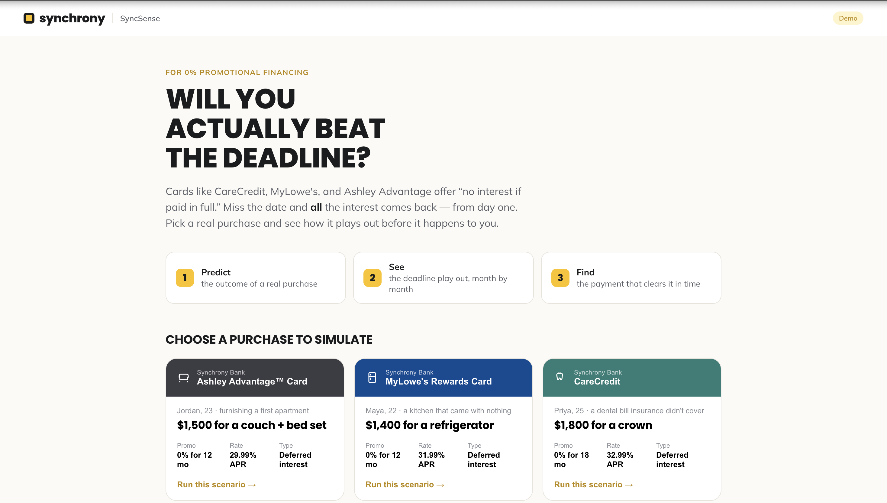

# SyncSense — Deadline Coach

An interactive learning tool that helps first-time credit users understand how **deferred-interest promotional financing** works on Synchrony cards (CareCredit, MyLowe's, Ashley Advantage, Synchrony HOME, Car Care). With a "no interest if paid in full" offer, interest is only charged if the promotional balance isn't paid off by the deadline — so the Deadline Coach lets cardholders see, in plain terms, exactly what their payments mean and how to clear a balance on time.




Each example runs a short flow: **predict**  the outcome across three quick questions → 
**see** the promotional period play out month by month → **find** the monthly payment that 
pays it off in time. A credit-score panel connects the purchase to credit utilization, and 
cardholders can build their own simulation from a catalog of real Synchrony cards.


## Run it

```bash
npm install
npm run dev      # http://localhost:5173
npm run build    # production build in dist/
```

Requires Node 18+.

## Project structure

```
src/
├── main.jsx                  # entry point, mounts <App>
├── App.jsx                   # top-level nav: home <-> builder <-> simulator
├── index.css                 # design tokens (fonts/colors) + all component styles
│
├── lib/                      # pure logic — no UI, easy to test or repoint
│   ├── simulate.js           # the deferred-interest engine (the core math)
│   ├── creditScore.js        # rule-based utilization -> score estimate
│   ├── questions.js          # builds the 3-question intuition sequence from the math
│   └── format.js             # money() / pct() helpers
│
├── data/                     # the content you'll edit most
│   ├── scenarios.js          # the three guided presets
│   ├── cards.js              # catalog of real Synchrony cards for "Try your own"
│   └── guesses.js            # the first prediction's answer options
│
└── components/               # one component per file
    ├── BrandBar.jsx          # top bar / wordmark
    ├── Home.jsx              # hero + how-it-works + scenario picker + "try your own" tile
    ├── ScenarioCard.jsx      # a preset card on the home grid
    ├── CardChip.jsx          # branded card label (shared by home + simulator + builder)
    ├── CardIcon.jsx          # inline card icons (sofa / fridge / tooth / home / car)
    ├── CustomBuilder.jsx     # "Try your own simulation" input form
    ├── Stepper.jsx           # 1 Predict / 2 See / 3 Find (presets only)
    ├── Simulator.jsx         # composes one run; presets quiz first, custom skips to chart
    ├── CliffChart.jsx        # the signature deferred-interest cliff (hand-drawn SVG)
    ├── StatStrip.jsx         # four-number outcome readout
    ├── PredictionGate.jsx    # the 3-question sequence with per-question feedback
    ├── PaymentFix.jsx        # the verdict + payment slider
    └── CreditScorePanel.jsx  # the "understanding" / credit-score layer
```

## How a run flows

- **Presets** (`data/scenarios.js`): predict → reveal → fix. The three questions and
  their correct answers are generated from `simulate()` in `lib/questions.js`, so they
  stay correct if a scenario's numbers change.
- **Custom** ("Try your own simulation"): pick a card from `data/cards.js` (which fixes
  the APR and the promo lengths that card actually offers), set the purchase amount and
  credit limit, and go straight to the chart + payment slider — no quiz.

Both paths feed the same scenario object into the same `Simulator`, so the chart, stats,
and score panel are shared.

## Where to extend

- **Add a preset** → push an object to `src/data/scenarios.js`.
- **Add a card to the builder** → push an object to `src/data/cards.js` (needs `apr`,
  `promos`, `minPurchase`, `icon`, `tone`, and defaults). Confirm it's a *deferred-interest*
  promo, not equal-pay — that's the whole point of the tool.
- **Change the math** → `src/lib/simulate.js` is a pure function. Swap the mock numbers
  for live MySynchrony account values and it just works.
- **Tune the score model** → `src/lib/creditScore.js`.
- **Restyle / change fonts** → the `@import` and `--disp` / `--body` tokens at the top of
  `src/index.css` re-theme the whole app from one place.

## Card terms

Representative new-account terms, current mid-2026 (APRs vary by creditworthiness; the
standard purchase APR is what posts retroactively if a promo balance isn't cleared in time):

| Card | Purchase APR | Promo lengths |
| --- | --- | --- |
| Ashley Advantage™ | 29.99% | 6 / 12 / 18 mo |
| MyLowe's Rewards | 31.99% | 6 / 12 mo |
| CareCredit | 32.99% | 6 / 12 / 18 / 24 mo |
| Synchrony HOME™ | 34.99% | 6 / 12 mo (longer at select partners) |
| Synchrony Car Care™ | 34.99% | 6 mo |

All issued by Synchrony Bank. Note: the Amazon Store Card was excluded because Synchrony
discontinued its deferred-interest financing in Feb 2026 (equal-pay only), so there's no
retroactive cliff to model.

## Disclaimer

A rule-based learning tool. Estimates only — not a credit decision, not financial advice.
